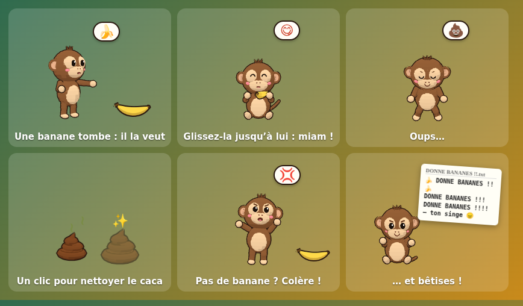

# 🐒 Singe de bureau

Un petit singe 3D mignon qui vit sur votre écran Windows 11 : il se promène sur la
barre des tâches, s'assoit, s'endort, se gratte la tête, fait coucou, grimpe sur vos
fenêtres… et vous pouvez l'attraper pour le lancer à travers l'écran. Les clics
traversent la fenêtre partout sauf sur lui : vous continuez à utiliser votre PC
normalement.

Et il faut s'en occuper : il fait **caca** (cliquez dessus pour nettoyer) et des
**bananes** tombent du ciel. Donnez-les-lui, sinon il se fâche et fait des
bêtises : il **bouscule vos fenêtres** ou vous ouvre des notes **« DONNE BANANES !! »**.

**Un seul petit fichier `.exe` (~3,6 Mo), rien à installer.**
→ [Télécharger Singe-de-bureau.exe](https://github.com/TomJ02/claude/releases/latest/download/Singe-de-bureau.exe)


---

## Sommaire

1. [Télécharger et lancer](#télécharger-et-lancer)
2. [Fonctionnalités](#fonctionnalités)
3. [Utilisation](#utilisation)
4. [Le jeu : caca, bananes et bêtises](#le-jeu--caca-bananes-et-bêtises)
5. [Compiler depuis le code source](#compiler-depuis-le-code-source)
6. [Générer l'exécutable (.exe)](#générer-lexécutable-exe)
7. [Personnaliser](#personnaliser)
8. [Remplacer le modèle 3D par un fichier .glb](#remplacer-le-modèle-3d-par-un-fichier-glb)
9. [Architecture du code](#architecture-du-code)
10. [Choix techniques](#choix-techniques)
11. [Performances](#performances)
12. [Dépannage](#dépannage)

---

## Télécharger et lancer

1. Téléchargez **[Singe-de-bureau.exe](https://github.com/TomJ02/claude/releases/latest/download/Singe-de-bureau.exe)**
   (~3,6 Mo), depuis la page [Releases](https://github.com/TomJ02/claude/releases/latest).
2. Double-cliquez dessus. C'est tout : c'est une **version portable**, rien n'est
   installé. Rangez-le où vous voulez (Bureau, Documents…).
3. Le singe tombe du haut de l'écran, atterrit sur la barre des tâches et vous fait
   coucou. Son icône apparaît dans la zone de notification (près de l'horloge,
   parfois dans le menu « ^ » des icônes cachées) : un clic dessus ouvre le menu.

> **« Windows a protégé votre ordinateur »** : l'exécutable n'est pas signé
> numériquement (un certificat coûte cher). Cliquez sur **Informations
> complémentaires → Exécuter quand même**. Une seule fois.

Vous préférez une vraie installation (raccourci dans le menu Démarrer,
désinstallation depuis *Paramètres → Applications*) ? Prenez plutôt
`Singe-de-bureau-2.0.0-installation.exe` (~1,4 Mo) sur la même page. Il
s'installe pour votre compte seulement, sans droits administrateur.

Pour qu'il démarre avec Windows : menu de l'icône → **Lancer au démarrage**.

**Configuration requise** : Windows 10 ou 11 (64 bits). L'appli utilise
*WebView2*, le moteur web d'Edge déjà présent dans Windows 11 et dans tout
Windows 10 à jour (sinon l'installateur le télécharge tout seul).

Chaque version est compilée et **testée automatiquement sur une vraie machine
Windows** par GitHub Actions (voir [`.github/workflows/windows.yml`](.github/workflows/windows.yml)) :
affichage 3D, banane, caca, survol du singe à la souris, déplacement d'une
fenêtre du Bloc-notes, note « DONNE BANANES !! », installation silencieuse.

---

## Fonctionnalités

| Catégorie | Détails |
|---|---|
| **Fenêtre** | Transparente, sans bordure, toujours au premier plan, couvre tout l'écran, absente de la barre des tâches et d'Alt+Tab |
| **Clics traversants** | La fenêtre ignore la souris sauf quand le curseur est *sur* le singe (détection précise par lancer de rayon sur le modèle 3D) |
| **Multi-écran** | Il passe à pied d'un écran à l'autre (écrans côte à côte) ; on peut aussi le glisser d'un écran à l'autre |
| **Le singe** | Low-poly / cartoon, contour sombre, ~125 px (100 à 200 px), construit en code avec des primitives Three.js, ou chargé depuis un `.glb` remplaçable |
| **Animations** | Marcher, s'asseoir (au sol ou jambes dans le vide sur une fenêtre), dormir (avec « Z z z »), bâiller, se gratter la tête, sauter, faire coucou, être content, tomber, être porté, grimper, être étourdi, faire caca, manger une banane, réclamer, trépigner de colère, taper une note |
| **Comportements** | Marche vers une destination (accélération et freinage, pas de téléportation), s'arrête, regarde autour de lui, alterne activité et repos selon son **énergie**, s'endort quand il est fatigué **ou** quand vous n'avez pas touché le PC depuis 2 min, se réveille quand vous revenez |
| **Fenêtres (bonus)** | Il grimpe sur le bord supérieur des fenêtres ouvertes (ou y saute si c'est bas), s'y assoit, se déplace avec la fenêtre si vous la bougez, tombe si elle est fermée/réduite, et redescend en sautant. Lâché au-dessus d'une fenêtre, il atterrit dessus |
| **Interactions** | Clic : il saute ou fait coucou · Glisser-déposer : il pend et se balance, puis retombe avec la gravité (on peut le *lancer*) · Appui long : on le soulève · Caresse (aller-retour du curseur sur lui) : il est content · Il tourne la tête vers le curseur et le suit parfois · Clic droit : menu |
| **Jeu** | Il fait caca (un clic pour nettoyer) · des bananes tombent du ciel : glissez-les jusqu'à lui · ignoré trop longtemps, il se fâche et fait des bêtises (déplace vos fenêtres, ouvre des notes « DONNE BANANES !! ») · tout est désactivable |
| **Zone de notification** | Pause / Reprendre, Vitesse, Taille, Grimper sur les fenêtres, Se cacher pendant le plein écran, Rappeler le singe ici, Jeu, Lancer au démarrage, Modèle 3D, Quitter |
| **Léger** | Un seul exécutable de ~3,6 Mo, sans installation ; ~0,3 % de processeur en moyenne (mesuré) |
| **Discrétion** | Se cache automatiquement quand une application est en plein écran (vidéo, jeu, présentation) et quand la session est verrouillée |

---

## Utilisation

| Action | Résultat |
|---|---|
| **Clic** sur le singe | Il saute ou fait coucou (et se réveille en sursaut s'il dormait) |
| **Glisser** | Vous le tenez par la peau du cou : il pend et se balance. Relâchez en mouvement pour le **lancer** |
| **Appui long** | Vous le soulevez sans bouger |
| **Caresse** (va-et-vient du curseur sur lui, sans cliquer) | Il est content ♥ |
| **Approcher le curseur** | Il vous regarde, et parfois vous suit |
| **Clic droit** sur le singe | Ouvre le même menu que l'icône de notification |
| **Relancer l'application** alors qu'elle tourne déjà | Rappelle le singe près du curseur |

Menu de l'icône de notification (clic gauche ou droit) :

- **Pause / Reprendre** : il s'assoit et ne bouge plus (l'animation s'arrête complètement : 0 % de CPU). On peut toujours cliquer sur lui ou le déplacer.
- **Vitesse** : ×0,5 / ×1 / ×1,5 / ×2 (vitesse de marche, de poursuite et d'escalade).
- **Taille** : 100, 125, 150 ou 200 px de haut.
- **Grimper sur les fenêtres** : active le bonus « rebords de fenêtres ».
- **Se cacher pendant le plein écran** : le singe disparaît pendant les vidéos/jeux en plein écran.
- **Rappeler le singe ici** : le fait réapparaître près du curseur (pratique en multi-écran).
- **Jeu (caca, bananes, bêtises)** : active ou non chaque élément du jeu (voir ci-dessous), fait tomber une banane tout de suite, ou nettoie tout le caca d'un coup.
- **Lancer au démarrage** : démarre avec Windows (session utilisateur).
- **Modèle 3D et réglages** : ouvre le dossier de l'appli (pour y déposer un `monkey.glb` ou un `config.json`), ou recharge le singe.
- **Quitter**.

Les choix du menu sont enregistrés dans `%APPDATA%\com.singedebureau.app\settings.json`.

---

## Le jeu : caca, bananes et bêtises



| Quoi | Comment ça marche |
|---|---|
| 💩 **Caca** | De temps en temps (toutes les 5 à 12 min, et peu après avoir mangé), il s'accroupit, pousse… et laisse un petit caca sur la barre des tâches avant de s'éloigner l'air de rien. **Cliquez dessus** pour le nettoyer. Il en laisse au plus 6 : au-delà, il attend que vous fassiez le ménage. |
| 🍌 **Bananes** | Toutes les 2 min 30 à 7 min, une banane tombe du ciel (elle peut atterrir sur une fenêtre). Il la montre du doigt : **attrapez-la et lâchez-la sur lui** (ou juste à côté). Il s'assoit et la mange, tout content. |
| 😠 **Patience** | Une banane qui traîne : après 30 s il la réclame en sautillant 🍌? ; après **60 s il se fâche** 💢 (sourcils froncés, il trépigne, ne fait plus coucou quand on clique). |
| 🙈 **Bêtises** | Tant qu'il est fâché, toutes les 25 à 45 s il fait une bêtise, en alternant : **il grimpe sur une de vos fenêtres et la fait glisser** de quelques centimètres (140 à 320 px) en trépignant dessus, ou **il tape une note** et ouvre dans le Bloc-notes un fichier « DONNE BANANES !!.txt » de plus en plus insistant (au plus une note toutes les 90 s). |
| 😋 **Le calmer** | Donnez-lui une banane : il se calme immédiatement et reste content un moment. |

Garde-fous :

- Le temps d'attente et les minuteries **s'arrêtent** quand vous n'êtes pas devant le PC, quand il dort, en pause, ou quand il est caché (plein écran, session verrouillée).
- Il ne déplace que des fenêtres d'applications « normales » (jamais une fenêtre agrandie, réduite, la barre des tâches ou le bureau), sans les activer ni les redimensionner, et toujours en les laissant aux trois quarts visibles. Cela nécessite l'option *Grimper sur les fenêtres* (Windows uniquement).
- Les notes sont écrites dans le dossier temporaire de Windows (`%TEMP%`) et s'ouvrent avec votre éditeur de texte par défaut.
- Chaque élément se désactive dans le menu **Jeu** : *Il fait caca*, *Des bananes tombent du ciel*, *déplacer vos fenêtres*, *ouvrir des notes*. Les fréquences et la patience se règlent dans `config.js > game`.

---

## Compiler depuis le code source

Seulement si vous voulez modifier le singe : pour l'utiliser, l'exécutable
[téléchargé](#télécharger-et-lancer) suffit.

### 1. Prérequis (une seule fois)

1. **Node.js 20 LTS ou plus récent** : installateur « LTS » sur <https://nodejs.org>
   (options par défaut). Il sert à préparer la page 3D (Three.js, esbuild).
2. **Rust** : téléchargez et lancez `rustup-init.exe` depuis <https://rustup.rs>,
   options par défaut. S'il le propose, laissez-le installer les **outils de
   compilation Visual Studio** (« Développement Desktop en C++ » : MSVC et SDK
   Windows) ; sinon installez-les depuis
   <https://visualstudio.microsoft.com/fr/visual-cpp-build-tools/>.
3. Vérifiez dans un terminal (*Windows Terminal* ou *PowerShell*), **ouvert après
   les installations** :
   ```powershell
   node --version    # v20 ou plus
   cargo --version   # 1.90 ou plus
   ```

Détails et autres systèmes : <https://v2.tauri.app/start/prerequisites/>.

### 2. Récupérer le projet et ses dépendances

```powershell
git clone https://github.com/TomJ02/claude.git singe-de-bureau
cd singe-de-bureau
npm install
```
(Ou « Code » → « Download ZIP » sur GitHub, décompressez, puis `npm install`
dans le dossier.)

### 3. Lancer en mode développeur

```powershell
npm run dev
```

La **première** compilation prend quelques minutes (Rust compile ses
bibliothèques une fois pour toutes) ; les suivantes, quelques secondes. Le singe
apparaît avec la **console de développement** (DevTools) ouverte, où l'objet `pet`
permet de jouer avec lui :
```js
pet.brain.go('sleep')            // le forcer à dormir
pet.brain.go('wave')             // coucou
pet.brain.go('walk', { target: 300 })  // marcher jusqu'à x = 300 px
pet.brain.energy = 0.1           // le fatiguer
pet.config.movement.walkSpeed = 150    // changer un réglage à chaud
pet.items.spawnBanana()          // faire tomber une banane
pet.brain.poopTimer = 0          // envie pressante...
pet.config.game.bananaPatience = 5     // il se fâche après 5 s au lieu de 60
```

Après avoir modifié un fichier de `src/renderer/` : `npm run web -- --dev` (ou
laissez tourner `npm run web:watch` dans un second terminal), puis menu →
*Modèle 3D et réglages → Recharger le singe*. Une modification du code Rust
(`src-tauri/`) relance l'appli automatiquement.

---

## Générer l'exécutable (.exe)

```powershell
npm run build
```

| Fichier produit | Usage |
|---|---|
| `src-tauri\target\release\singe-de-bureau.exe` | **Version portable** : ce seul fichier suffit (c'est celui de la release, renommé `Singe-de-bureau.exe`) |
| `src-tauri\target\release\bundle\nsis\Singe de bureau_2.0.0_x64-setup.exe` | **Installateur** (menu Démarrer, désinstallation propre, sans droits administrateur) |

`npm run build:exe` ne fabrique que l'exécutable portable (plus rapide).

L'exécutable est optimisé pour la taille (`[profile.release]` de
`src-tauri/Cargo.toml` : `opt-level = "s"`, LTO, symboles retirés) et contient
tout : la page, Three.js, les icônes, et le modèle `assets/models/monkey.glb`
s'il existe.

**Sans rien installer** : chaque `git push` sur GitHub fabrique et teste l'exe
(onglet *Actions* → dernier passage → *Artifacts*), et la branche par défaut
publie la release. Pour une nouvelle version : changez `version` dans
`src-tauri/tauri.conf.json` (et `package.json`, `Cargo.toml`), puis poussez.

Pour tester l'appli comme le fait l'intégration continue :
```powershell
$env:SINGE_SELFTEST = "$PWD\rapport.json"; .\src-tauri\target\release\singe-de-bureau.exe
```
Elle joue un scénario (banane, repas, caca, nettoyage, survol par le curseur…),
écrit `rapport.json` et se ferme. Voir aussi `scripts/ci/selftest.ps1`.

> **macOS / Linux** : le même code compile (`npx tauri build --bundles app` sur
> un Mac, `--bundles deb` sous Linux), mais le bonus des fenêtres (grimper,
> bousculer, se cacher en plein écran) n'existe que sous Windows.

---

## Personnaliser

Tout est commenté en français. Les fichiers à connaître :

| Je veux changer… | Fichier |
|---|---|
| Vitesses, gravité, durées, fréquence des activités, sommeil, souris, couleurs… | `src/renderer/config.js` |
| Les mouvements d'une animation (angles des bras, des jambes…) | `src/renderer/animations.js` |
| Les comportements (ce qu'il décide de faire, quand, comment) | `src/renderer/behaviors.js` |
| La forme du singe (tête, oreilles, queue…) | `src/renderer/monkey.js` |
| Les bulles « ! », « ? », « ♥ », « Z z z », l'ombre | `src/renderer/effects.js`, `style.css` |
| Le menu de notification | `src-tauri/src/tray.rs`, choix de vitesses/tailles dans `src-tauri/src/settings.rs` |
| Le jeu : fréquence du caca et des bananes, patience, bêtises | `src/renderer/config.js > game` ; logique dans `behaviors.js` (en bas : `_updateGame`, `mischief`, `feed`) |
| L'allure de la banane et du caca | `src/renderer/props.js` (objets 3D), `items.js` (comportement à l'écran) |
| Fréquence de surveillance des fenêtres et du curseur | constantes en haut de `src-tauri/src/overlay.rs` |

### Sans recompiler : `config.json`

Avec l'exécutable téléchargé, créez un fichier **`config.json`** dans le dossier de
l'appli (menu → *Modèle 3D et réglages → Ouvrir le dossier…*, soit
`%APPDATA%\com.singedebureau.app`). Ses valeurs remplacent celles de
`config.js` (mêmes noms, seulement ce que vous voulez changer), par exemple :
```json
{
  "movement": { "walkSpeed": 120 },
  "sleep": { "afterUserIdle": 300 },
  "game": { "bananaPatience": 120 },
  "colors": { "fur": 14262374 }
}
```
(les couleurs s'écrivent en décimal : `0xd9a066` = `14262374`). Puis menu →
*Recharger le singe*. Un exemple commenté `config-exemple.json` est créé dans ce
dossier quand vous l'ouvrez depuis le menu.

### Exemples dans `config.js`

```js
movement: {
  walkSpeed: 70,        // ← 120 pour un singe pressé
  gravity: 2600,        // ← 1200 pour des chutes "sur la Lune"
  ...
},
weights: {
  walk: 5,              // ← plus grand = marche plus souvent
  climb: 1.4,           // ← 0 pour ne jamais grimper sur les fenêtres
  explore: 0.8,         // ← 0 pour qu'il reste sur son écran
  ...
},
sleep: {
  afterUserIdle: 120,   // ← s'endort après 2 min sans clavier/souris
},
cursor: {
  followChance: 0.35,   // ← 1 = il vous suit à chaque fois
},
colors: {
  fur: 0x8b5a34,        // ← 0xd9a066 pour un singe doré
},
```

Les vitesses sont données pour un singe de 125 px et s'adaptent automatiquement
à la taille choisie ; le menu « Vitesse » les multiplie encore.

### Modifier une animation (`animations.js`)

Chaque animation est une fonction qui reçoit la `pose` (angles en radians) et le
temps `t`. Par exemple, pour un coucou plus énergique :

```js
wave: {
  lookWeight: 0.5,
  pose(p, { t }) {
    p.armLRaise = 1.75;                     // bras levé sur le côté
    p.foreLSide = 0.55 + sin(t * 14) * 0.6; // ← 14 au lieu de 10 : plus rapide, plus ample
    p.mouthOpen = 0.55;                     // bouche ouverte
    ...
  },
},
```

Les transitions entre animations (fondus) sont automatiques.

### Ajouter un comportement (`behaviors.js`)

1. Créez l'animation dans `animations.js`, par ex. `dance: { lookWeight: 0, pose(p, { t }) { ... } }`.
2. Ajoutez un état dans `STATES` :
   ```js
   dance: {
     enter(b, d) { b.m.play('dance'); d.dur = 3; },
     update(b, dt, d) { if (b.t >= d.dur) b.go('idle'); },
   },
   ```
3. Ajoutez-le aux choix dans `decide()` : `['dance', 0.5],` et `case 'dance': return this.go('dance');`.
4. Ajoutez `'dance'` à la liste `ACTIVE` (en haut du fichier) pour qu'il soit animé à 60 images/s.

---

## Remplacer le modèle 3D par un fichier .glb

1. Exportez votre modèle au format **glTF binaire (.glb)** depuis Blender, ou
   récupérez-en un (Sketchfab, Mixamo + Blender…).
2. Nommez-le **`monkey.glb`** et placez-le :
   - **dans le dossier de l'appli** : menu de l'icône → *Modèle 3D et réglages →
     Ouvrir le dossier…* (`%APPDATA%\com.singedebureau.app`, fonctionne avec
     l'exécutable téléchargé, prioritaire), **ou**
   - dans `assets/models/` du projet : il sera alors intégré à l'exécutable à la
     prochaine compilation.
3. Menu → *Modèle 3D et réglages → Recharger le singe*. Pour revenir au singe
   intégré, supprimez le fichier.

Contraintes :

- Le modèle doit **regarder vers l'avant (+Z)**, debout sur l'axe Y (convention
  glTF standard). Sinon, ajustez `glb.rotationY` dans `config.js`.
- La taille n'a pas d'importance : il est mis à l'échelle automatiquement, pieds au sol.
- Les **animations sont reconnues par leur nom** (la casse est ignorée, un nom
  partiel suffit : `Walk_Cycle` → marche). Liste complète dans `glb.clips` de `config.js` :

| Animation du singe | Noms reconnus dans le .glb |
|---|---|
| debout | `idle`, `stand`, `breath` |
| marche | `walk`, `run` |
| assis / assis sur une fenêtre | `sit` / `sitledge` |
| dort / bâille | `sleep`, `lie`, `rest` / `yawn`, `stretch` |
| se gratte | `scratch` |
| coucou / content | `wave`, `hello`, `coucou` / `happy`, `dance`, `cheer` |
| saut / chute / atterrissage | `jump`, `air` / `fall` / `land` |
| porté / grimpe / étourdi | `drag`, `hang`, `grab` / `climb` / `dizzy` |

  Une animation absente est remplacée par la plus proche (ex. pas de `sleep` →
  `sit` → `idle`). Seule `idle` est vraiment utile ; `walk` est fortement
  conseillée.
- Si le squelette a un os nommé `head`, il tournera la tête vers le curseur
  (désactivable avec `glb.headLook: false`).

---

## Architecture du code

```
singe-de-bureau/
├── package.json              scripts (dev, build, web) et dépendances JavaScript
├── assets/                   grande icône (générée par `npm run icons`) et models/
├── scripts/
│   ├── build-web.mjs         assemble la page dans dist-web/ (esbuild + Three.js)
│   ├── generate-icons.js     dessine les icônes (PNG/ICO/ICNS) sans dépendance
│   └── ci/                   auto-test et mesure de consommation (PowerShell)
├── .github/workflows/        compilation + tests Windows + release
├── src-tauri/                PROGRAMME PRINCIPAL (Rust, Tauri 2)
│   ├── tauri.conf.json       nom, version, icônes, installateur, sécurité de la page
│   ├── Cargo.toml            dépendances Rust, options de taille de l'exe
│   ├── icons/                icônes de l'exe et de la zone de notification
│   └── src/
│       ├── main.rs           démarrage, plugins (instance unique, démarrage auto)
│       ├── overlay.rs        fenêtre transparente plein écran, clics traversants,
│       │                     curseur, multi-écran, surveillance, commandes de la page
│       ├── system.rs         API Win32 : fenêtres et rebords, déplacer une fenêtre,
│       │                     inactivité, session verrouillée, premier plan
│       ├── tray.rs           icône et menu de notification
│       ├── settings.rs       réglages persistants (settings.json)
│       ├── pranks.rs         bêtises : bousculer une fenêtre, écrire une note
│       └── selftest.rs       auto-test (SINGE_SELFTEST)
└── src/renderer/             PAGE (affichage et logique du singe, dans WebView2)
    ├── index.html, style.css
    ├── platform.js           pont page ↔ Rust (commandes et événements Tauri)
    ├── renderer.js           point d'entrée, boucle d'animation à cadence variable
    ├── config.js             ★ tous les réglages
    ├── behaviors.js          ★ le "cerveau" : machine à états, énergie, physique, jeu
    ├── animations.js         ★ les animations (poses procédurales)
    ├── monkey.js             le singe 3D construit en primitives Three.js
    ├── gltfMonkey.js         adaptateur pour un modèle .glb
    ├── stage.js              scène Three.js, caméra, lancer de rayon
    ├── world.js              sol, bords d'écran, rebords de fenêtres
    ├── input.js              souris : survol, clic, glisser, caresse
    ├── effects.js            ombre, « Z z z », bulles d'émotion
    ├── items.js              objets à l'écran : cacas et bananes (chute, clic, glisser)
    ├── props.js              banane et caca en 3D (même style que le singe)
    ├── sprites.js            transforme ces objets 3D en images au démarrage
    ├── toon.js               matériaux cartoon partagés (paliers, contour, facettes)
    └── selftest.js           scénario de l'auto-test
```

Fonctionnement en bref :

```
 ┌────────── programme principal (Rust, overlay.rs) ──────────┐        ┌──────────── page (renderer.js) ────────────┐
 │ fenêtre transparente sur l'écran du singe, toujours devant  │ world  │ behaviors.js  décide (marcher, dormir…)    │
 │ curseur lu ~60×/s → pet:cursor (seulement s'il a bougé)     │──────▶ │ animations.js calcule la pose              │
 │ fenêtres Win32 → rebords (1×/s), fenêtre sous le singe 20×/s│ cursor │ monkey.js     applique la pose au modèle   │
 │ inactivité, session verrouillée, plein écran, écrans        │ ledges │ stage.js      dessine un petit canvas WebGL │
 │ zone de notification, réglages, bêtises                     │──────▶ │ input.js      curseur sur le singe ?        │
 │ set_ignore_cursor_events(oui/non)                           │ ◀──────│ set_ignore_mouse / track_window / prank    │
 └─────────────────────────────────────────────────────────────┘        └────────────────────────────────────────────┘
```

La page ne peut appeler que les quelques commandes déclarées dans `main.rs`
(`generate_handler!`) : pas d'accès aux fichiers, pas de réseau (politique de
sécurité dans `tauri.conf.json`).

---

## Choix techniques

**Tauri 2 + Three.js** plutôt qu'Electron + Three.js :

| | Electron | **Tauri 2** (choisi) |
|---|---|---|
| Exécutable | ~110 Mo à télécharger (embarque tout Chromium) | **~3,6 Mo** (utilise WebView2, déjà dans Windows) |
| Moteur web | une copie de Chromium dans chaque appli | WebView2, fourni et mis à jour par Windows |
| API Windows | via une bibliothèque FFI (koffi) | appels Win32 directs (crate `windows`), compilés dans l'exe |
| Le code du singe | Three.js | **le même**, inchangé |

- La seule vraie difficulté était le **clic traversant avec détection du survol** :
  Electron sait transmettre les mouvements de souris à une fenêtre qui laisse
  passer les clics, Tauri non. Le programme Rust lit donc lui-même la position
  du curseur (~60 fois/s, un appel système de quelques microsecondes) et ne la
  transmet à la page que si elle change ; la page vérifie par lancer de rayon si
  le curseur touche le singe et demande à Rust de capter ou de laisser passer
  la souris. Le résultat est identique, et vérifié automatiquement sur Windows.
- **Unity / Godot** donneraient de beaux rendus, mais la fenêtre transparente
  plein écran avec clics traversants y demande du code natif spécifique, et
  l'exécutable est bien plus lourd.
- **Three.js** permet de construire le singe en code (aucun fichier à fournir),
  de charger un `.glb` standard, et dessine sur le GPU. esbuild n'en garde que
  ce qui sert : toute la page fait ~700 Ko.

---

## Performances

Objectif : < 5 % de CPU au repos et 60 images/s fluides quand il bouge.

- **Petit canvas mobile** : la fenêtre couvre l'écran, mais le rendu WebGL ne se
  fait que dans un carré de ~2× la taille du singe, déplacé par une transformation
  CSS (gérée par le compositeur). On ne redessine jamais tout l'écran.
- **Cadence variable** : 60 i/s quand il bouge, 30 i/s debout/assis (respiration,
  clignements), 20 i/s quand il dort, **0 i/s en pause** (la boucle s'arrête
  totalement et se réveille au moindre événement). Réglable dans `config.js > render`.
- **Rien n'est dessiné** quand il est caché (plein écran, session verrouillée : la fenêtre est masquée).
- **Effets en HTML** (ombre, bulles) animés par la même boucle : pas d'animation
  CSS qui tournerait en permanence.
- **Bananes et cacas** : dessinés une seule fois en 3D au démarrage, puis affichés
  comme de simples images ; ils ne coûtent rien tant qu'ils ne bougent pas.
- **Surveillance légère, en Rust** : position du curseur ~60×/s (transmise à la
  page seulement quand elle change), liste des fenêtres 1×/s (moins d'une
  milliseconde), suivi de la seule fenêtre sous le singe 20×/s, inactivité
  utilisateur toutes les 5 s.
- **Cadence plafonnée** : même sur un écran 120/144 Hz, jamais plus de 60 i/s.
- **Exécutable léger** : ~3,6 Mo ; le moteur web (WebView2) est celui de
  Windows, mis à jour avec lui.
- Rendu `powerPreference: 'low-power'` (GPU intégré sur les PC portables),
  résolution limitée à 2× sur les écrans très denses.

Mesuré automatiquement à chaque compilation, sur une machine Windows **sans
carte graphique** (la 3D y est donc calculée par le processeur, le cas le plus
défavorable), pendant 40 s de vie normale : **0,3 % de processeur** au total
(1,2 % d'un seul cœur) et ~150 Mo de mémoire en tout (appli + moteur WebView2).
Résultat dans le résumé de chaque passage de l'onglet *Actions*.

Pour réduire encore : baissez `fpsCalm` / `fpsSleep`, désactivez `antialias` ou
`outline` dans `config.js`, ou décochez « Grimper sur les fenêtres ».

---

## Dépannage

| Problème | Solution |
|---|---|
| Le singe n'apparaît pas | Regardez dans la zone de notification (« ^ ») si l'icône est là ; utilisez *Rappeler le singe ici*. Vérifiez qu'aucune appli n'est en plein écran (il se cache alors). Si l'appli refuse de démarrer, installez le [runtime WebView2](https://developer.microsoft.com/microsoft-edge/webview2/) (« Evergreen Bootstrapper »). Depuis les sources, `npm run dev` affiche les erreurs. |
| Fond noir au lieu de transparent | Pilote graphique ancien ou accélération matérielle désactivée : mettez à jour le pilote GPU. |
| Je ne peux plus cliquer sur une zone de l'écran | Survolez puis quittez le singe avec la souris (cela rebascule le mode "clics traversants"), ou mettez-le en pause. Signalez le cas : ça ne devrait pas arriver. |
| CPU élevé | Vérifiez que l'accélération GPU fonctionne (sinon le rendu se fait sur le processeur) ; réduisez les fps dans `config.js`. |
| Il ne grimpe jamais sur les fenêtres | Option cochée dans le menu ? Il faut des fenêtres non maximisées, avec un bord supérieur visible, assez larges, et à une bonne hauteur au-dessus de la barre des tâches. `weights.climb` règle la fréquence. |
| Il ne change pas d'écran à pied | Les écrans doivent être côte à côte (bord à bord) dans *Paramètres → Affichage*, et la barre des tâches ne doit pas être sur le bord commun. Glisser-déposer ou *Rappeler le singe ici* fonctionnent dans tous les cas. |
| Antivirus / SmartScreen bloque l'exe | Exécutable non signé : *Informations complémentaires → Exécuter quand même* (voir [Télécharger et lancer](#télécharger-et-lancer)). |
| Il déplace mes fenêtres / m'ouvre des notes | C'est qu'il est fâché : donnez-lui la banane qui traîne ! Ou décochez *déplacer vos fenêtres* / *ouvrir des notes* (ou *Des bananes tombent du ciel*) dans le menu **Jeu**. |
| Il ne bouscule jamais de fenêtre | Il faut l'option *Grimper sur les fenêtres*, une fenêtre non agrandie où il peut monter, et Windows refuse qu'une appli normale déplace les fenêtres lancées « en tant qu'administrateur ». |
| `npm run dev` / `npm run build` échoue : « linker `link.exe` not found » | Il manque les outils de compilation Visual Studio (« Développement Desktop en C++ ») : voir [Prérequis](#1-prérequis-une-seule-fois). Rouvrez le terminal après l'installation. |

Pour repartir de zéro : quittez l'appli et supprimez le dossier
`%APPDATA%\com.singedebureau.app` (réglages, modèle, config.json).

Limites connues : écrans aux échelles différentes (100 % / 150 %) : le passage
d'un écran à l'autre peut décaler le singe de quelques pixels. Sous Linux et
macOS, pas de bonus des fenêtres.
