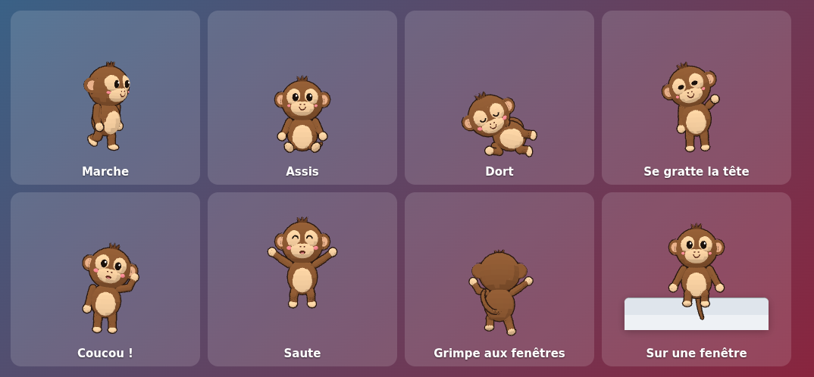

# 🐒 Singe de bureau

Un petit singe 3D mignon qui vit sur votre écran Windows 11 : il se promène sur la
barre des tâches, s'assoit, s'endort, se gratte la tête, fait coucou, grimpe sur vos
fenêtres… et vous pouvez l'attraper pour le lancer à travers l'écran. Les clics
traversent la fenêtre partout sauf sur lui : vous continuez à utiliser votre PC
normalement.



---

## Sommaire

1. [Fonctionnalités](#fonctionnalités)
2. [Installation et lancement (pas à pas)](#installation-et-lancement-pas-à-pas)
3. [Utilisation](#utilisation)
4. [Générer un exécutable (.exe / .app)](#générer-un-exécutable-exe--app)
5. [Personnaliser](#personnaliser)
6. [Remplacer le modèle 3D par un fichier .glb](#remplacer-le-modèle-3d-par-un-fichier-glb)
7. [Architecture du code](#architecture-du-code)
8. [Choix techniques](#choix-techniques)
9. [Performances](#performances)
10. [Dépannage](#dépannage)

---

## Fonctionnalités

| Catégorie | Détails |
|---|---|
| **Fenêtre** | Transparente, sans bordure, toujours au premier plan, couvre tout l'écran, absente de la barre des tâches et d'Alt+Tab |
| **Clics traversants** | La fenêtre ignore la souris sauf quand le curseur est *sur* le singe (détection précise par lancer de rayon sur le modèle 3D) |
| **Multi-écran** | Il passe à pied d'un écran à l'autre (écrans côte à côte) ; on peut aussi le glisser d'un écran à l'autre |
| **Le singe** | Low-poly / cartoon, contour sombre, ~125 px (100 à 200 px), construit en code avec des primitives Three.js, ou chargé depuis un `.glb` remplaçable |
| **Animations** | Marcher, s'asseoir (au sol ou jambes dans le vide sur une fenêtre), dormir (avec « Z z z »), bâiller, se gratter la tête, sauter, faire coucou, être content, tomber, être porté, grimper, être étourdi |
| **Comportements** | Marche vers une destination (accélération et freinage, pas de téléportation), s'arrête, regarde autour de lui, alterne activité et repos selon son **énergie**, s'endort quand il est fatigué **ou** quand vous n'avez pas touché le PC depuis 2 min, se réveille quand vous revenez |
| **Fenêtres (bonus)** | Il grimpe sur le bord supérieur des fenêtres ouvertes (ou y saute si c'est bas), s'y assoit, se déplace avec la fenêtre si vous la bougez, tombe si elle est fermée/réduite, et redescend en sautant. Lâché au-dessus d'une fenêtre, il atterrit dessus |
| **Interactions** | Clic : il saute ou fait coucou · Glisser-déposer : il pend et se balance, puis retombe avec la gravité (on peut le *lancer*) · Appui long : on le soulève · Caresse (aller-retour du curseur sur lui) : il est content · Il tourne la tête vers le curseur et le suit parfois · Clic droit : menu |
| **Zone de notification** | Pause / Reprendre, Vitesse, Taille, Grimper sur les fenêtres, Se cacher pendant le plein écran, Rappeler le singe ici, Lancer au démarrage, Modèle 3D, Quitter |
| **Discrétion** | Se cache automatiquement quand une application est en plein écran (vidéo, jeu, présentation) et quand la session est verrouillée |

---

## Installation et lancement (pas à pas)

### 1. Prérequis (une seule fois)

1. **Node.js 22 LTS ou plus récent** (Electron 44 exige Node ≥ 22.12) :
   téléchargez l'installateur « LTS » sur <https://nodejs.org> et installez-le
   avec les options par défaut.
2. Vérifiez dans un terminal (*Windows Terminal* ou *PowerShell*) :
   ```powershell
   node --version   # doit afficher v22.12 ou plus
   npm --version
   ```

### 2. Récupérer le projet

Avec Git :
```powershell
git clone https://github.com/TomJ02/claude.git singe-de-bureau
cd singe-de-bureau
```
Ou téléchargez le ZIP depuis GitHub (« Code » → « Download ZIP »), décompressez-le
puis ouvrez un terminal dans le dossier.

### 3. Installer les dépendances

```powershell
npm install
```

Cela installe Three.js (3D), koffi (accès à l'API Windows pour repérer les
fenêtres), Electron et electron-builder. Au **premier** lancement, Electron
télécharge son moteur (~100 Mo) : c'est normal, une seule fois.

### 4. Lancer le singe

```powershell
npm start
```

Le singe tombe du haut de l'écran, atterrit sur la barre des tâches et vous fait
coucou. Son icône apparaît dans la zone de notification (en bas à droite, parfois
dans le menu « ^ » des icônes cachées).

Mode développeur (ouvre les DevTools, utile pour modifier le code) :
```powershell
npm run dev
```
Dans la console des DevTools, l'objet `pet` permet de jouer avec lui :
```js
pet.brain.go('sleep')            // le forcer à dormir
pet.brain.go('wave')             // coucou
pet.brain.go('walk', { target: 300 })  // marcher jusqu'à x = 300 px
pet.brain.energy = 0.1           // le fatiguer
pet.config.movement.walkSpeed = 150    // changer un réglage à chaud
```
Après avoir modifié un fichier du dossier `src/renderer/`, appuyez sur **Ctrl+R**
dans les DevTools pour recharger ; pour `src/main/`, relancez `npm run dev`.

---

## Utilisation

| Action | Résultat |
|---|---|
| **Clic** sur le singe | Il saute ou fait coucou (et se réveille en sursaut s'il dormait) |
| **Glisser** | Vous le tenez par la peau du cou : il pend et se balance. Relâchez en mouvement pour le **lancer** |
| **Appui long** | Vous le soulevez sans bouger |
| **Caresse** (va-et-vient du curseur sur lui, sans cliquer) | Il est content ♥ |
| **Approcher le curseur** | Il vous regarde, et parfois vous suit |
| **Clic droit** sur le singe | Ouvre le même menu que l'icône de notification |
| **Relancer l'application** alors qu'elle tourne déjà | Rappelle le singe près du curseur |

Menu de l'icône de notification (clic gauche ou droit) :

- **Pause / Reprendre** : il s'assoit et ne bouge plus (l'animation s'arrête complètement : 0 % de CPU). On peut toujours cliquer sur lui ou le déplacer.
- **Vitesse** : ×0,5 / ×1 / ×1,5 / ×2 (vitesse de marche, de poursuite et d'escalade).
- **Taille** : 100, 125, 150 ou 200 px de haut.
- **Grimper sur les fenêtres** : active le bonus « rebords de fenêtres ».
- **Se cacher pendant le plein écran** : le singe disparaît pendant les vidéos/jeux en plein écran.
- **Rappeler le singe ici** : le fait réapparaître près du curseur (pratique en multi-écran).
- **Lancer au démarrage** : démarre avec Windows (session utilisateur).
- **Modèle 3D** : ouvre le dossier où déposer un `monkey.glb`, ou recharge le singe.
- **Quitter**.

Les réglages sont enregistrés dans `%APPDATA%\Singe de bureau\settings.json`.

---

## Générer un exécutable (.exe / .app)

Les exécutables se génèrent avec [electron-builder](https://www.electron.build/).

### Windows (.exe) — à lancer sur Windows

```powershell
npm run dist
```

Résultat dans le dossier `dist\` :

| Fichier | Usage |
|---|---|
| `Singe-de-bureau-Setup-1.0.0.exe` | **Installateur** (choix du dossier, raccourcis Bureau et menu Démarrer, désinstallation propre) |
| `Singe-de-bureau-1.0.0-portable.exe` | **Version portable** : un seul fichier, aucune installation |
| `win-unpacked\Singe de bureau.exe` | Version décompressée (pour tester rapidement) |

> L'exécutable n'est pas signé numériquement : au premier lancement, Windows
> SmartScreen peut afficher « Windows a protégé votre PC ». Cliquez sur
> **Informations complémentaires → Exécuter quand même**. (Pour l'éviter, il faut
> un certificat de signature de code, voir la doc d'electron-builder.)

Pour tester l'empaquetage sans créer d'installateur : `npm run pack`.

### macOS (.app dans un .dmg) — à lancer sur un Mac

```bash
npm install
npm run dist:mac
```

Résultat : un fichier `.dmg` dans `dist/`, contenant `Singe de bureau.app`
(sans icône dans le Dock, uniquement dans la barre des menus). Non signée :
faites **clic droit → Ouvrir** la première fois. Sur macOS, tout fonctionne sauf
le bonus « grimper sur les fenêtres » et « se cacher en plein écran », qui
utilisent l'API Windows.

> Il faut construire chaque version sur son propre système (un `.exe` sous
> Windows, un `.app` sous macOS) : les dépendances natives (koffi) sont
> installées pour la plateforme courante par `npm install`.

---

## Personnaliser

Tout est commenté en français. Les fichiers à connaître :

| Je veux changer… | Fichier |
|---|---|
| Vitesses, gravité, durées, fréquence des activités, sommeil, souris, couleurs… | `src/renderer/config.js` |
| Les mouvements d'une animation (angles des bras, des jambes…) | `src/renderer/animations.js` |
| Les comportements (ce qu'il décide de faire, quand, comment) | `src/renderer/behaviors.js` |
| La forme du singe (tête, oreilles, queue…) | `src/renderer/monkey.js` |
| Les bulles « ! », « ? », « ♥ », « Z z z », l'ombre | `src/renderer/effects.js`, `style.css` |
| Le menu de notification | `src/main/tray.js`, choix de vitesses/tailles dans `src/main/settings.js` |
| Fréquence de surveillance des fenêtres | constantes en haut de `src/main/main.js` |

### Exemples dans `config.js`

```js
movement: {
  walkSpeed: 70,        // ← 120 pour un singe pressé
  gravity: 2600,        // ← 1200 pour des chutes "sur la Lune"
  ...
},
weights: {
  walk: 5,              // ← plus grand = marche plus souvent
  climb: 1.4,           // ← 0 pour ne jamais grimper sur les fenêtres
  explore: 0.8,         // ← 0 pour qu'il reste sur son écran
  ...
},
sleep: {
  afterUserIdle: 120,   // ← s'endort après 2 min sans clavier/souris
},
cursor: {
  followChance: 0.35,   // ← 1 = il vous suit à chaque fois
},
colors: {
  fur: 0x8b5a34,        // ← 0xd9a066 pour un singe doré
},
```

Les vitesses sont données pour un singe de 125 px et s'adaptent automatiquement
à la taille choisie ; le menu « Vitesse » les multiplie encore.

### Modifier une animation (`animations.js`)

Chaque animation est une fonction qui reçoit la `pose` (angles en radians) et le
temps `t`. Par exemple, pour un coucou plus énergique :

```js
wave: {
  lookWeight: 0.5,
  pose(p, { t }) {
    p.armLRaise = 1.75;                     // bras levé sur le côté
    p.foreLSide = 0.55 + sin(t * 14) * 0.6; // ← 14 au lieu de 10 : plus rapide, plus ample
    p.mouthOpen = 0.55;                     // bouche ouverte
    ...
  },
},
```

Les transitions entre animations (fondus) sont automatiques.

### Ajouter un comportement (`behaviors.js`)

1. Créez l'animation dans `animations.js`, par ex. `dance: { lookWeight: 0, pose(p, { t }) { ... } }`.
2. Ajoutez un état dans `STATES` :
   ```js
   dance: {
     enter(b, d) { b.m.play('dance'); d.dur = 3; },
     update(b, dt, d) { if (b.t >= d.dur) b.go('idle'); },
   },
   ```
3. Ajoutez-le aux choix dans `decide()` : `['dance', 0.5],` et `case 'dance': return this.go('dance');`.
4. Ajoutez `'dance'` à la liste `ACTIVE` (en haut du fichier) pour qu'il soit animé à 60 images/s.

---

## Remplacer le modèle 3D par un fichier .glb

1. Exportez votre modèle au format **glTF binaire (.glb)** depuis Blender, ou
   récupérez-en un (Sketchfab, Mixamo + Blender…).
2. Nommez-le **`monkey.glb`** et placez-le :
   - **dans le dossier de données** : menu de l'icône → *Modèle 3D → Ouvrir le
     dossier du modèle…* (fonctionne aussi avec l'exécutable installé), **ou**
   - dans `assets/models/` du projet (il sera alors inclus dans l'exécutable).
3. Menu → *Modèle 3D → Recharger le singe*. Pour revenir au singe intégré,
   supprimez le fichier.

Contraintes :

- Le modèle doit **regarder vers l'avant (+Z)**, debout sur l'axe Y (convention
  glTF standard). Sinon, ajustez `glb.rotationY` dans `config.js`.
- La taille n'a pas d'importance : il est mis à l'échelle automatiquement, pieds au sol.
- Les **animations sont reconnues par leur nom** (la casse est ignorée, un nom
  partiel suffit : `Walk_Cycle` → marche). Liste complète dans `glb.clips` de `config.js` :

| Animation du singe | Noms reconnus dans le .glb |
|---|---|
| debout | `idle`, `stand`, `breath` |
| marche | `walk`, `run` |
| assis / assis sur une fenêtre | `sit` / `sitledge` |
| dort / bâille | `sleep`, `lie`, `rest` / `yawn`, `stretch` |
| se gratte | `scratch` |
| coucou / content | `wave`, `hello`, `coucou` / `happy`, `dance`, `cheer` |
| saut / chute / atterrissage | `jump`, `air` / `fall` / `land` |
| porté / grimpe / étourdi | `drag`, `hang`, `grab` / `climb` / `dizzy` |

  Une animation absente est remplacée par la plus proche (ex. pas de `sleep` →
  `sit` → `idle`). Seule `idle` est vraiment utile ; `walk` est fortement
  conseillée.
- Si le squelette a un os nommé `head`, il tournera la tête vers le curseur
  (désactivable avec `glb.headLook: false`).

---

## Architecture du code

```
singe-de-bureau/
├── package.json              dépendances, scripts, configuration d'electron-builder
├── assets/                   icônes (générées par `npm run icons`) et modèles/
├── scripts/
│   ├── generate-icons.js     dessine l'icône (PNG/ICO) sans dépendance
│   └── include-three-addons.js  inclut le chargeur .glb dans l'exécutable
└── src/
    ├── preload.js            pont sécurisé page ↔ processus principal (window.petAPI)
    ├── main/                 PROCESSUS PRINCIPAL (Node.js)
    │   ├── main.js           fenêtre plein écran transparente, clics traversants,
    │   │                     multi-écran, surveillance, cycle de vie
    │   ├── tray.js           icône et menu de notification
    │   ├── settings.js       réglages persistants
    │   ├── protocol.js       protocole local app:// pour servir les fichiers
    │   └── windowTracker.js  liste des fenêtres Windows (API Win32 via koffi)
    └── renderer/             PAGE (affichage et logique du singe)
        ├── index.html, style.css
        ├── renderer.js       point d'entrée, boucle d'animation à cadence variable
        ├── config.js         ★ tous les réglages
        ├── behaviors.js      ★ le "cerveau" : machine à états, énergie, physique
        ├── animations.js     ★ les animations (poses procédurales)
        ├── monkey.js         le singe 3D construit en primitives Three.js
        ├── gltfMonkey.js     adaptateur pour un modèle .glb
        ├── stage.js          scène Three.js, caméra, lancer de rayon
        ├── world.js          sol, bords d'écran, rebords de fenêtres
        ├── input.js          souris : survol, clic, glisser, caresse
        └── effects.js        ombre, « Z z z », bulles d'émotion
```

Fonctionnement en bref :

```
 ┌──────────── processus principal (main.js) ────────────┐        ┌──────────── page (renderer.js) ────────────┐
 │ fenêtre transparente sur l'écran du singe             │ world  │ behaviors.js  décide (marcher, dormir…)    │
 │ setIgnoreMouseEvents(true, {forward:true})            │──────▶ │ animations.js calcule la pose              │
 │ windowTracker : fenêtres Win32 → rebords (1×/s)        │ ledges │ monkey.js     applique la pose au modèle   │
 │ suivi de la fenêtre sous le singe (20×/s)             │──────▶ │ stage.js      dessine un petit canvas WebGL │
 │ inactivité utilisateur, verrouillage, plein écran     │        │ input.js      survol → "ignore la souris ?" │
 │ zone de notification, réglages                        │ ◀──────│ ignore-mouse / display-at / track-window   │
 └───────────────────────────────────────────────────────┘        └────────────────────────────────────────────┘
```

---

## Choix techniques

**Electron + Three.js**, comme proposé, est le meilleur compromis ici :

- **Clics traversants avec détection du survol** : Electron fournit
  `setIgnoreMouseEvents(true, { forward: true })`, qui laisse passer les clics
  tout en continuant à transmettre les mouvements de souris à la page. C'est
  exactement ce qu'il faut pour savoir quand le curseur passe sur le singe.
  **Tauri** (plus léger : ~10 Mo au lieu de ~100 Mo) propose
  `set_ignore_cursor_events`, mais sans cette transmission : il faudrait sonder
  la position du curseur en Rust et réimplémenter le basculement — plus complexe
  et plus fragile, pour un gain surtout en taille de fichier.
- **Unity / Godot** donneraient de beaux rendus, mais la fenêtre transparente
  plein écran avec clics traversants y demande du code natif spécifique à
  Windows, et l'exécutable est bien plus lourd.
- **Three.js** permet de construire le singe en code (aucun fichier à fournir),
  de charger un `.glb` standard, et tourne sur le GPU.
- **koffi** (FFI) appelle directement l'API Win32 (`EnumWindows`,
  `DwmGetWindowAttribute`) pour le bonus des fenêtres : pas de compilation C++,
  pas de PowerShell lancé en boucle (très coûteux), binaires précompilés fournis.
  C'est une dépendance *optionnelle* : sans elle, tout fonctionne sauf ce bonus.

Sécurité : la page n'a pas accès à Node.js (`contextIsolation`, `sandbox`), ne
charge que des fichiers locaux via un protocole `app://` dédié, et ne communique
qu'au travers de quelques messages validés.

---

## Performances

Objectif : < 5 % de CPU au repos et 60 images/s fluides quand il bouge.

- **Petit canvas mobile** : la fenêtre couvre l'écran, mais le rendu WebGL ne se
  fait que dans un carré de ~2× la taille du singe, déplacé par une transformation
  CSS (gérée par le compositeur). On ne redessine jamais tout l'écran.
- **Cadence variable** : 60 i/s quand il bouge, 30 i/s debout/assis (respiration,
  clignements), 20 i/s quand il dort, **0 i/s en pause** (la boucle s'arrête
  totalement et se réveille au moindre événement). Réglable dans `config.js > render`.
- **Rien n'est dessiné** quand il est caché (plein écran, session verrouillée).
- **Effets en HTML** (ombre, bulles) animés par la même boucle : pas d'animation
  CSS qui tournerait en permanence.
- **Surveillance légère** : liste des fenêtres 1×/s via FFI (quelques
  millisecondes), suivi de la seule fenêtre sous le singe 20×/s (3 appels
  système), inactivité utilisateur toutes les 5 s.
- Rendu `powerPreference: 'low-power'` (GPU intégré sur les PC portables),
  résolution limitée à 2× sur les écrans très denses.

Pour réduire encore : baissez `fpsCalm` / `fpsSleep`, désactivez `antialias` ou
`outline` dans `config.js`, ou décochez « Grimper sur les fenêtres ».

---

## Dépannage

| Problème | Solution |
|---|---|
| Le singe n'apparaît pas | Regardez dans la zone de notification (« ^ ») si l'icône est là ; utilisez *Rappeler le singe ici*. Lancez `npm run dev` pour voir les erreurs dans la console. Vérifiez qu'aucune appli n'est en plein écran (il se cache alors). |
| Fond noir au lieu de transparent | Pilote graphique ancien ou accélération matérielle désactivée : mettez à jour le pilote GPU. |
| Je ne peux plus cliquer sur une zone de l'écran | Survolez puis quittez le singe avec la souris (cela rebascule le mode "clics traversants"), ou mettez-le en pause. Signalez le cas : ça ne devrait pas arriver. |
| CPU élevé | Vérifiez que l'accélération GPU fonctionne (sinon le rendu se fait sur le processeur) ; réduisez les fps dans `config.js`. |
| Il ne grimpe jamais sur les fenêtres | Option cochée dans le menu ? Il faut des fenêtres non maximisées, avec un bord supérieur visible, assez larges, et à une bonne hauteur au-dessus de la barre des tâches. `weights.climb` règle la fréquence. |
| Il ne change pas d'écran à pied | Les écrans doivent être côte à côte (bord à bord) dans *Paramètres → Affichage*, et la barre des tâches ne doit pas être sur le bord commun. Glisser-déposer ou *Rappeler le singe ici* fonctionnent dans tous les cas. |
| Antivirus / SmartScreen bloque l'exe | Exécutable non signé : voir [Générer un exécutable](#générer-un-exécutable-exe--app). |
| `npm install` échoue sur koffi | C'est une dépendance optionnelle : l'appli marche quand même, sans le bonus des fenêtres. |

Limites connues : sous Linux, les fenêtres transparentes ne transmettent pas les
mouvements de souris quand elles laissent passer les clics (on ne peut donc pas
attraper le singe) ; écrans aux DPI différents : Electron/Windows peuvent décaler
légèrement la position lors du passage d'un écran à l'autre.
